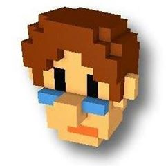

# About fallingCAT #
----------

網路上我的暱稱是fallingCAT，而在業界大家都叫我Owen。

1996年退伍之後我便進入遊戲公司工作，算一算至今已經研發遊戲21年。從一開始進入業界，我便開始研發3D遊戲引擎，一路從3D繪圖卡還沒發明的software rendering 3D engine年代開始，陸續經過3dfx Voodoo卡盛行，OpenGL fixed function，一直到Direct3D 9稱霸，走到目前mobile OpenGL ES的年代。中間我也曾經歷幾次的console開發經歷，包含Sega Saturn，Sega Dreamcast，XBOX以及PS2，所以目前LynxEngine的原始碼中還留有一些console時代程式庫的代碼遺跡 :)

在工作期間，我除了幫公司開發的引擎之外，下班後還陸陸續續開發過三個大小不同的遊戲引擎，大都是跟著顯示卡以及API的轉變而開始新的引擎專案。最後一個引擎是我2005年赴加拿大ATI工作時開始的專案，也是目前開發過最大的一個引擎專案，除了引擎本身，也打造了一個專用的遊戲編輯器，在後面的projects列表中會有一些介紹。因為當時是在顯卡公司工作，因工作之便，便將很多當時最先進的繪圖技術都加入了引擎之中。

2012年我回台後做了一年獨立開發，一年後成立了遊戲公司Qubit Games，這期間開發了兩款手機遊戲Space Qube以及Qubot，都是使用我最後開發的遊戲引擎LynxEngine來研發。最近我再次成為自由的獨立遊戲開發者，但是這次不再使用自己的遊戲引擎了 :)  目前有一款新的遊戲正在構思中，希望明年可以亮相，請大家拭目以待囉。

## Skills ##

- Assembly/C/Objective-C/C++/C#/Lua
- Shader Languages
- Graphics/Shader Optimization
- Advanced Graphics/Shader Programming
- Cross-Platform Engine Developing
- Game Tool Developing
- Unity
- Unreal Engine

## Projects ##
### In-Developing Title (multi-platform, 2018) ###

Blade of Strangers (Nintendo Switch, 2018)
協助開發團隊將遊戲引擎繪圖功能由原本的OpenGL ES移植至Nintendo Switch原生的NVN。
Helping the development team to port graphics engine from OpenGL ES to Nintendo Switch native NVN API.
Unreal Engine 4 Customization (PC, 2018)
修改Unreal Engine 4 增加一個新的Subsurface Scattering Skin Shading Model，此Shading Model是根據Nvidia的Faceworks的文章實作出Subsurface Scattering，Subsurface Scattering Shadow以及Deep Scattering for deferred shading。
Modifying Unreal Engine 4  to add a new subsurface scattering skin shading model which is based on the article of Nvidia's Faceworks. I implemented Subsurface Scattering，Subsurface Scattering Shadow and Deep Scattering for deferred shading。

### Qubot (mobile, 2017) ###

Qubot是我2014年成立Qubit Games之後開始研發的手機遊戲，是一款免費的機器人回合戰鬥類手游。遊戲最大的特點是以voxel所組成的機甲可以任意更換部位及駕駛員，戰場上的四台機甲還可以合體發動合體技能，遊戲也提供機甲編輯器讓玩家自行創作機甲。這款遊戲也是利用之前下班研發的LynxEngine來當作底層引擎。

由於一開始並沒有太多研發預算，這款遊戲一開始也是只有我一個程式在開發client端，直到後期才陸續又其他程式加入。遊戲主要使用C++/Objective-C/Java 加上Lua來開發。編輯器部分則是使用wxWidget來處理GUI的部分。Rendering部分除了使用了voxel動態變形之外，還加入了Depth of field，Pixel motion blur，Radial blur以及動態Ambient occlusion效果。

Qubot is the mobile F2P game I developed after founding Qubit Games. It's a turn based robot fighting game. It uses voxel to render the robots and the players can combine any 4 gears and one pilot to form a robot. The 4 robots on battle field can combine into one mega robot and give the enemies a mega strike. Qubot also provides a robot editor to let the players create their very own robot. This game is also based on LynxEngine.

During the first few years of developing, I was the only client engineer again.... It was developed using C++/Objective-C/Java and some Lua. On the editor side, I used wxWidget for GUI handing. On rendering side, I developed dynamic voxel transformation effect, depth of filed, pixel motion blur, radial blur and dynamic ambient occlusion.

### Space Qube (mobile, 2013) ###
2012年回到台灣後開發的第一個獨立遊戲，並利用之前下班研發的LynxEngine來當作底層引擎。

遊戲最主要的特色是以Voxel所組成的遊戲架構，並提供遊戲內的編輯器讓玩家可以自己創作遊戲中的飛行器，並可以透過網路來和其他玩家交換模型。

Space Qube於2013年九月上線，並被Apple選為2013年最佳獨立遊戲之一。同時Space Qube在2013年也獲得GDC Best in Play獎項以及Tokyo Game Show的Sense Of Wonder Night獎項。

In 2012, I returned to Taiwan and started developing my first indie game, Space Qube, which is based on my LynxEngine.

Space Qube is a space on-rail shooting game based on voxel rendering. The players can use the in-game editor to create their very own spaceship and exchange their spaceships with other players via the Internet.

Space Qube was released on September 2013 and selected as one of the best indie games of 2013 by Apple. Space Qube also won GDC 2013 best in play award and Sense Of Wonder Night award of Tokyo game show 2013.

### LynxEngine (cross-platform, 2005 ~ 2011) ###
2005年到加拿大工作後，利用下班時間製作的一個免費引擎計劃。引擎目標是設計一個跨平台的引擎，並包含一個十分直覺的遊戲編輯器提供最基本的遊戲製作功能。而編輯器本身有設計plug-in系統，所以一些額外的擴充功能像是第三方檔案輸入，SpeedTree的支援等等，都可以利用plug-in來完成。引擎以及編輯器基本上是使用C++以及MFC來開發的。
當時因為本身在AMD繪圖卡部門工作的關係，在rendering方面則支援當時很多先進的rendering技術，像是Deferred shading, Parallax occlusion mapping, SSAO，Motion blur等等。Scripting部分則同時支援Lua以及C#。繪圖底層部分則是支援了D3D9, D3D11, OpenGL以及OpenGL ES。
之後因為開始獨立遊戲的開發而停止了這個計畫，不過之後開發的Space Qube以及Qubot遊戲都是建立在這個引擎基礎上的手機遊戲。
LynxEngine is my after work side project when I was working for AMD. The original plan was developing an open source cross-platform engine which is small but has a very intuitive editor. It's very like Unity you saw today. The original design of the editor contains the plug-in system so any user can develop their own plug-ins like custom file importer or SpeedTree support, etc.  The engine was developed by C++ and MFC.

Since I was working for AMD at that time, I also added many advanced rendering features into the engine like deferred shading, parallax occlusion mapping, SSAO, motion blur, etc. The scripting system supports Lua and C#. The graphics supports D3D9, D3D11, OpenGL and OpenGL ES.

I stopped this project when I decided to be an indie game developer in 2012. But the following mobile games, Space Qube and Qubot, are all based on this engine.

### Stake (XBOX, 2000 ~ 2003) ###
Stake是2000~2003年時我所參與開發的一款XBOX遊戲。遊戲原本是在PC上開發，之後移植到XBOX上發行。Stake是一款可以最多八人同樂的動作對戰遊戲，原本支援網路對戰，但因為開發時間因素最後取消了網路對戰功能。而原本PC版計畫推出編輯器讓玩家製作MOD的功能也因改版至XBOX而作罷。

因為當時團隊中只有我一位程式，所以Stake的遊戲以及引擎和遊戲編輯器都由我一人開發，當時是使用C加上部分Assembly以及 Win32 SDK來開發。原本在PC上繪圖部分是使用 OpenGL fixed function，移植至XBOX則替換成Direct3D加上Shader 1.x。當時用了一些DOF，Reflection mapping等技巧來提升rendering質感。

Stake is the game I developed during 2000 to 20003. The original target platform is PC then I ported it to XBOX and finally released on XBOX. Stake is a fighting game which supports 8 players in one stage. The original idea is that the 8 players can connect with the Internet but we canceled this feature due to lacking of time. And we also planed to release the game editor with the game on PC so the players can make their own MOD but this plan also be canceled since we finally released the game on XBOX.

I am the only engineer at that time so I developed the engine, the game and the editor. I was using C and some assembly to develop this game and Windows SDK for the editor. The engine was based on OpenGL API with fixed function when developing for PC. After porting to XBOX, I changed the engine to use Direct3D with shader 1.x. I added few new rendering features to the XBOX version like DOF and reflection mapping.
[秘辛]第一款國產XBOX遊戲製作回憶錄 - Part One

### ATI/AMD SDK (2005~2012) ###
2005~2012年間我在加拿大ATI/AMD擔任資深圖形工程師時所發表的一些電腦圖學的技術文章以及範例程式。主要是教導遊戲開發者如何使用ATI/AMD的繪圖技術來達成一些先進繪圖效果以及如何針對繪圖卡最佳化的技巧。

Here are some graphics sample code and documents I wrote when working for ATI/AMD as senior ISV engineer during 2005 to 2012. Those samples teach the game developers how to achieve some advanced rendering effects or optimize the rendering code via AMD's technologies.

## GDC session (2012)  ##
我於2012年舊金山GDC所發表的一個講座，主要是教導開發者如何使用一些我為AMD顯卡所開發的UE3擴充功能來提升遊戲的繪圖效能。

This is the session I had on GDC 2012 in SF. The topic is how to use my code contributions for UE3 to optimize the game performance on AMD's hardware. 

https://www.slideshare.net/OwenWu/enhancing-graphics-in-unreal-engine-3-titles-using-new-code-submissions

## Titles I supported (2005~2012) ##
2005~2012年間我在加拿大ATI/AMD擔任資深圖形工程師時所支援過的一些3A遊戲。當時主要的工作是協助這些遊戲開發者最佳化遊戲的繪圖程式碼，有時還會幫忙開發者開發一些新的繪圖功能。比如協助Splinter Cell開發對floating point render target的MSAA支援，讓HDR的畫面也可以開啟MSAA。也曾幫助Max Payne 3開發並最佳化遊戲中的Tessellation功能。也曾幫忙改寫UE3的DX10 Bokeh DOF 後製效果讓DX9的顯卡也能使用此一後製效果，並改進其執行效率。

Those are some AAA titles I have supported when working for ATI/AMD in Canada. At that time, my job was helping the game developers to optimize their graphics code. And sometimes I also need to develop some new graphics features for them. For example, I helped Splinter Cell to enable the MSAA on floating-point render target so the game can support HDR with MSAA. I also helped Max Payne 3 optimizing their DX10 tessellation shader. I also ported UE3 DX10 only Bokeh DOF post-processing to DX9 and improved its performance on AMD's hardware.

Unreal Engine 3

Gears Of War

Max Payne 3

Splinter Cell : Double Agent

Street Fighter IV

Devil May Cry 4

Lost Planet
